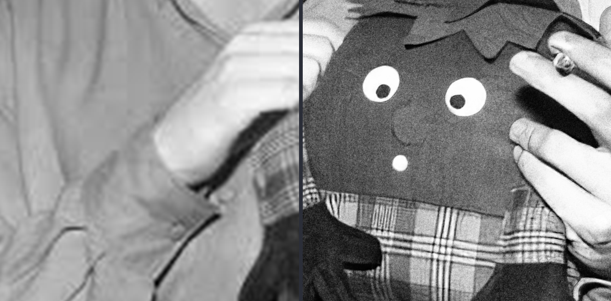

# Senn6x

Senn6x is an experimental Residual Channel Attention Network designed for Image Super-Resolution.



The code is built on [RCAN](https://github.com/yulunzhang/RCAN) and the model was trained on the [DIV2K](http://www.vision.ee.ethz.ch/~timofter/publications/Agustsson-CVPRW-2017.pdf) dataset.


## Dependencies

- Python 3
- PyTorch >= 1.0.0
- numpy
- skimage
- imageio
- matplotlib
- tqdm

## Code

Clone this repository.
```bash
git clone https://github.com/Senn1/Senn6x
cd Senn6x
```

# Training

#### Training dataset
- 1. Download the DIV2K dataset [here](https://data.vision.ee.ethz.ch/cvl/DIV2K/)
- 2. Set the directory to the HR (high resolution) and LR (Low Resolution) paths

#### Training the model

- 1. CD to 'Trainingcode/model'
- 2. Run the trainmain.py script

```python
python trainmain.py
```

# Quick Test

- 1. Download the [pretrained models](https://www.youtube.com/watch?v=yVihOxP2QeY) here
- 2. CD to 'testcode/model'

Run these following scripts:
>  
>  # Senn2x
> 
>  python main.py  --model san  --data_test MyImage  --save `save_name`  --scale 2 ../model/Senn_BIX2.pt  
> 
>  # Senn4x   
> 
>  python main.py  --model senn6x --data_test MyImage  --save `save_name`  --scale 4 ../model/Senn_BIX4.pt  
> 
>  # Senn6x
>  python main.py  --model senn6x --data_test MyImage  --save `save_name`  --scale 6 ../model/Senn_BIX6.pt
> 

## Results

The results are in the /results folder. Test results for popular datasets can also be downloaded [here](https://www.youtube.com/watch?v=pAoDgCF-feg). (placeholder link)

## Contributing
Pull requests are welcome. For major changes, please open an issue first to discuss what you would like to change.

Please make sure to update tests as appropriate.

## License
[MIT](https://choosealicense.com/licenses/mit/)